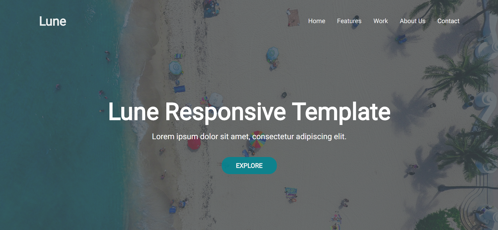

# Lune
Lune is a fully open-source one-page template build with HTML and CSS. It is suitable for small agencies and businesses.

## Preview

## Built With

* HTML - Forms the structure of the file
* CSS - Adjusts the layout and styling
* [FontAwesome](http://fontawesome.io/) - Adds the icons
* [Roboto](https://fonts.google.com/specimen/Roboto) - Ah! The font.

## Authors

* **Varun A P** - *Initial work* - [apvarun](https://github.com/apvarun)

## License

This project is licensed under the MIT License - see the [LICENSE.md](LICENSE.md) file for details
